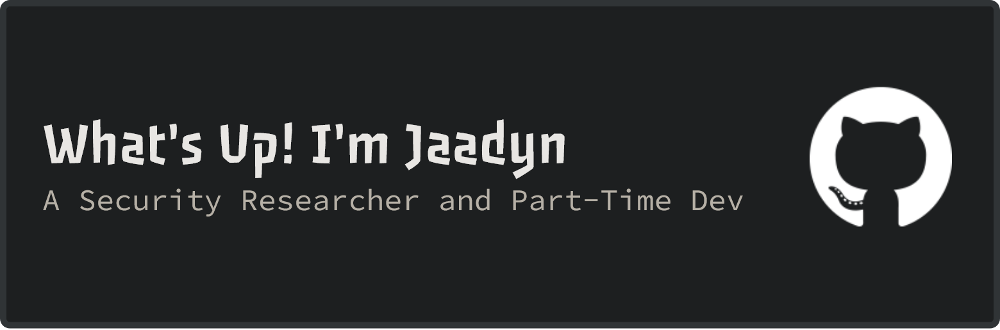

<!-- ================= HEADER ================= -->

  

 

<!-- ================= SKILLS ================= -->

<h3>About Me</h3>

Hi! My name is Jaadyn Humphries, Online I go by the handle Ryushe. I love to code, cook, participate in CTFs such as Hack The Box and play soccer. Currently, I've been working on personal projects such as a home server and studying a bunch of red team techniques. I hope you enjoy your stay here.
 

<!-- ================= BLOG ================= -->

If you have time check out my 
  <a href="https://ryushe.github.io/">Blog</a>!

<!-- ================= TABLE ================= -->

  

<!-- ================= CONNECT ================= -->

<h3 align="left">Let's Connect!</h3>

<!-- ================= CERTIFICATIONS ================= -->

<h3> Current Certifications: </h3>

- CompTIA Security+
- TryHackMe – Offensive Pentesting
- Flation Cyber Security
- HackerRank – Python (Basic)

<!--
## Stats

  

-->

<!--

  Hobbies: Lifting, Coding, CTFs, Sleeping 💤

-->
